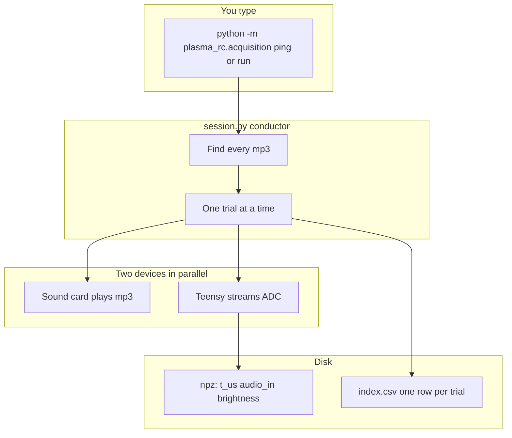

# Acquisition pipeline

PC-side capture for the Teensy 4.1 plasma setup. Records only `(t_us, audio_in, brightness)` at **100 kHz** (one sample every 10 µs). Frequency and settle are computed later, not here.

This package is a **recorder**, not an analyser: play each mp3 into the bulb, sample the injected voltage and the photodiode together, save the raw traces.

## How it works

### Two clocks

They are not the same. Do not wait for “audio changed.” Do not use PROTOCOL.md’s old ~0.5 s log rate.

| Clock | What it is | Rate |
| --- | --- | --- |
| Input | Sound card playing the mp3 into the breakout | ~44.1 kHz analog |
| Record | Teensy dual ADC, both channels at once | 100 kHz = every 10 µs |

At each Teensy tick you get **one** `t_us`, **one** `audio_in`, **one** `brightness`. The same `audio_in` over many later timestamps with changing brightness is expected: that is the plasma flickering while the voltage is held.

### Mental map

Four layers:

- `cli.py` — front door. `ping` asks whether a 100 kHz board is there; `run` starts a full session.
- `session.py` — conductor. Walks the audio tree, runs one trial per file, writes npz + index.
- `audio_device.py` — speaker: decode mp3, play it, note PC timing.
- `serial_io.py` — Teensy USB: handshake, pull binary frames, rebuild the 10 µs timeline.

`config.yaml` holds the knobs (rate, pre/post roll, paths).



### One trial

For `different word/banana/Sami/b3.mp3`:

1. Parse the path → speaker `sami`, condition `different_word`, label `banana`, take `3`.
2. `sync()` — PC sends `START`. Board replies `SYNC,<micros>`. That pairs Teensy time with PC time. A background thread starts reading USB frames immediately so capture does not pause while audio plays.
3. Sleep `pre_roll_s` (default 1 s) — still recording silence.
4. Play the mp3 — analog voltage into the breakout; Teensy still samples both ADCs.
5. Sleep `post_roll_s` (default 1 s).
6. `stop()` — PC sends `STOP`. Board replies `STOPPED` with frames sent and dropped. The thread joins. Samples are concatenated into three arrays.
7. Write `out_dir/raw/sami/different_word/banana/b3.npz` and one line in `index.csv`.

Same-word files (`same word/75/majesty/a12.mp3`) work the same way; `label` is the volume (`75`) instead of the word.

If a trial fails (bad CRC, `block_seq` gap, or audio decode/play error), it is discarded (no npz, no index row) and the next mp3 runs.

### USB frames

The Teensy does not send one USB packet per sample. It sends blocks of 64 pairs:

```text
magic | block number | time of first sample | 64 x (brightness, audio) | CRC
```

The PC checks CRC, rejects sequence gaps, then:

`t_us[i] = t_start_us + i * 10`  (because 1/100000 s = 10 µs)

The saved timeline is board microseconds, not whenever Python happened to notice.

### On disk

- **npz** — the recording: `t_us`, `audio_in`, `brightness`, `fs_hz`.
- **index.csv** — the catalogue: speaker, condition, take, playback timing, sample count, dropped frames.

No frequency. No settle. Those are a later script with a window chosen then.

Firmware is not in this package; it must stream at 100 kHz to match `fs_hz`.

## Install

```bash
pip install -e ".[acquisition]"
```

`pydub` needs `ffmpeg` on PATH if `soundfile` cannot decode mp3.

## Config

[`config.yaml`](config.yaml) next to this package. Paths (`audio_root`, `out_dir`) are resolved from the process working directory.

- `fs_hz: 100000` — record clock. Handshake fails if the board reports a different rate.
- `audio_root: ./data/Data`
- `out_dir: ./data/out`
- `audio_device: null` — first `run` prompts and writes the index back into this file. Do not commit a machine-specific index.

## Commands

```bash
python -m plasma_rc.acquisition ping
python -m plasma_rc.acquisition run
python -m plasma_rc.acquisition --config /path/to/config.yaml --port /dev/ttyACM0 ping
```

`ping` only checks PING/PONG. `run` plays every `*.mp3` under `audio_root` (pre-roll, file, post-roll) while the Teensy streams, then writes:

- `out_dir/raw/<speaker>/<condition>/<label>/<stem>.npz` — arrays `t_us`, `audio_in`, `brightness` and scalar `fs_hz`
- `out_dir/index.csv` — one row per successful trial

A failed trial (bad CRC, `block_seq` gap, or audio decode/play error) is aborted: nothing is written for that file, then the next mp3 runs.

## Hardware

Teensy 4.1 analog pins are **3.3 V max, not 5 V tolerant**. Scale and clamp the breakout tap and photodiode load before connecting. Firmware is not in this package; it must sample at 100 kHz to match `fs_hz`. 1 MHz is a later experiment, not the default.

## Tests without a board

[`tests/test_acquisition_hardware.py`](../../tests/test_acquisition_hardware.py) uses a FakeSerial. Set `USE_REAL_HARDWARE = True` only for a short real ping/stream; CRC-injection tests stay fake.
